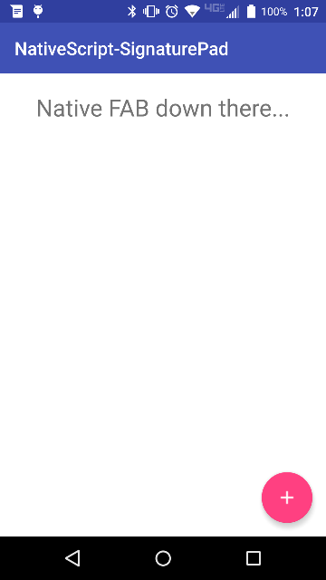

# NativeScript-FloatingActionButton
XML widget to create the Material Design Floating Action Button for Android NativeScript apps

[Material Design Floating Action Button Spec](https://www.google.com/design/spec/components/buttons-floating-action-button.html)

## Installation
`npm install nativescript-floatingactionbutton`

### Screenshot
---------------


## Usage

#### XML
##### **NOTE** The sample XML here will position the FAB on top of the ListView. There is no need for absolute positioning.
```XML
<Page xmlns="http://schemas.nativescript.org/tns.xsd"
      xmlns:FAB="nativescript-floatingactionbutton">
    <grid-layout rows="auto, *, auto">
        <list-view row="1">                            
            <list-view.itemTemplate>
                <label text="Hello" />                            
            </list-view.itemTemplate>                            
        </list-view>
        <android row="1">
	        <FAB:fab tap="fabTap" icon="ic_menu_camera"  backColor="#ff4081"  rippleColor="#f1f1f1" class="fab-button" />                        
        </android>  
   </grid-layout>
</Page>
```

#### CSS
I recommend the following CSS styles.
```CSS
.fab-button {
    height: 70;
    horizontal-align: right;
    vertical-align: bottom;
    margin: 15;
}
```

#### JS

```JS
function fabTap(args) {
    console.log('tapped');
}
exports.fabTap = fabTap;
```

#### Attributes
**backColor** - optional

Attribute to specify the background color of the FAB

**rippleColor** - optional

Attribute to set the ripple color on lollipop devices, it will fill the FAB on pre-lollipop devices

**icon** - required

Attribute to specify which icon to use for the FAB button, supports the same image source options that NativeScript images support.

### Contributors

- L�zaro Danillo [lazaromenezes](https://github.com/lazaromenezes)
