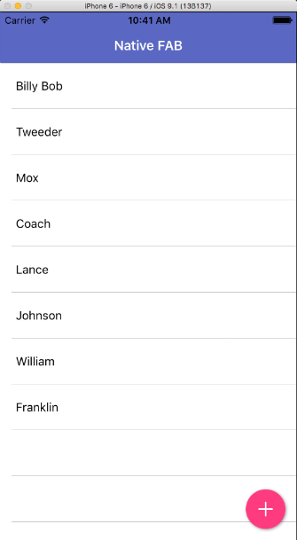
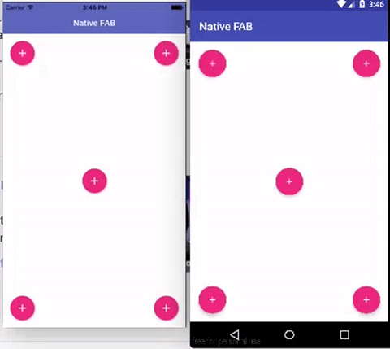

[](https://www.npmjs.com/package/nativescript-floatingactionbutton)
[](https://www.npmjs.com/package/nativescript-floatingactionbutton)

# NativeScript-FloatingActionButton
XML widget to create the Material Design Floating Action Button for NativeScript apps.

[Material Design Floating Action Button Spec](https://www.google.com/design/spec/components/buttons-floating-action-button.html)

## Installation
`npm install nativescript-floatingactionbutton`

### Screenshot
---------------



### Multiple FAB/Swipe Animation Support


## Usage

#### XML
##### **NOTE** The sample XML here will position the FAB on top of the ListView. There is no need for absolute positioning.
```XML
<Page xmlns="http://schemas.nativescript.org/tns.xsd" loaded="pageLoaded"
      xmlns:FAB="nativescript-floatingactionbutton">
    <Page.actionBar>
        <ActionBar title="Native FAB" backgroundColor="#3F51B5" color="#fff" />
    </Page.actionBar>
    <grid-layout rows="auto, *">
        <list-view row="1" items="{{ users }}">
            <list-view.itemTemplate>
                <label text="{{ name }}" textWrap="true" fontSize="18" margin="20" />
            </list-view.itemTemplate>
        </list-view>
            <FAB:fab tap="fabTap"
                     row="1"
                     icon="res://ic_add_white"
                     rippleColor="#f1f1f1"
                     class="fab-button" />
    </grid-layout>
</Page>
```
PLEASE NOTE: The fab is on the same **row number** as the listview 
***

#### CSS
Recommended CSS styles.
```CSS
.fab-button {
    height: 70;
    margin: 15;
    background-color: #ff4081; 
    horizontal-align: right; 
    vertical-align: bottom; 
}
```

***

#### JS

```JS
exports.fabTap = function(args) {
    console.log('tapped');
}
```

***

## Attributes

| Property   |      Android      |  iOS | Description | Note |
|------------|-------------------|------|-------------|------|
| backColor  |         X         | X    | Sets the background color of the button | Better set in CSS
| icon       |         X         | X     | Supports the same image source options that NativeScript images support | Required on android
| rippleColor|         X         |      | Ripple color on lollipop devices, it will fill the FAB on pre-lollipop devices | None
| hideOnSwipeOfView|         X         |   X   | Directs the fab to animate itself in and out on scroll | Pass it the name of the view to monitor for a scroll event example: hideOnSwipeOfView="userListView"
| hideAnimationDuration|         X         |   X   | How many milliseconds it takes for the button to hide. | Default if not set: 300ms
| swipeAnimation|         X         |   X   | slideDown, slideUp, slideLeft, slideRight, scale | Default is slideDown

## NativeScript Compatibility

| NativeScript Version | FloatingActionButton Plugin Version |
|----------------------|-------------------------------------|
| 1.6+                  | 2.+                                 |
| 1.5                  | 1.91                                |  

## iOS Notes
- We're using [MNFloatingActionButton](http://cocoapods.org/pods/MNFloatingActionButton) by [Matt Nydam](https://github.com/mattnydam)
- Width\Height are requried properties
- icon is a required property, if left as empty string default will be shown

## Release Notes ##
### 2.2.0 ###
* Scale iOS images to 1/2 height
* swipeAnimation property added to define animations for the FAB

### Contributors

- Lázaro Danillo [lazaromenezes](https://github.com/lazaromenezes)
- Steve McNiven-Scott [sitefinitysteve](https://github.com/sitefinitysteve) - iOS
- Nathanael Anderson [NathanaelA]("https://github.com/NathanaelA)
- Gabriel Marinho [gabrielbiga](https://github.com/gabrielbiga)