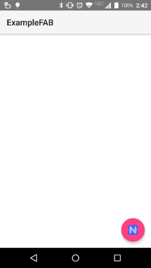

# NativeScript-FloatingActionButton
XML widget to create the Material Design Floating Action Button for Android NativeScript apps

[Material Design Floating Action Button Spec](https://www.google.com/design/spec/components/buttons-floating-action-button.html)

## Installation
`npm install nativescript-floatingactionbutton`

### Screenshot
---------------


## Usage

#### XML
```XML
<Page xmlns="http://schemas.nativescript.org/tns.xsd"
      xmlns:FAB="nativescript-floatingactionbutton/fab">
    <FAB:fab tap="fabTap"
         icon="icon"
         rippleColor="#FF8A80"
         class="fab-button" />
</Page>
```

#### CSS
I recommend the following CSS styles.
```CSS
.fab-button {
    height: 70;
    horizontal-align: right;
    vertical-align: bottom;
    margin: 15;
    background-color: #3489db;
}
```

#### JS

```JS
function fabTap(args) {
    console.log('tapped');
}
exports.fabTap = fabTap;
```

#### Attributes
**backgroundColor** - optional

Attribute to specify the background color of the FAB

**rippleColor** - optional

Attribute to set the ripple color on lollipop devices, it will fill the FAB on pre-lollipop devices

**icon** - required

Attribute to specify which icon to use for the FAB button. Currently this needs to be an image in the App_Resources folder.
PRs welcome to enhance the icon/image functionality.

